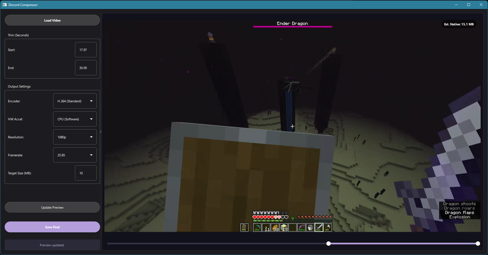
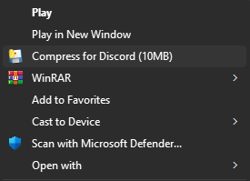

# Discord-Compressor
Easily compress videos so they fit in Discord's 10MB limit 

Basically 100% vibecoded sorry

This adds an option to your right click menu to compress your video to 1080p 10MB. If you right click and open with discord compressor, or open the exe and then load a file, you can trim the clip, change compression methods, target file size, resolution and frame rate. 
Uses ffmpeg and python, that's why the exe is so big. 

## Screenshots

**The App Interface**

**Right-Click Menu Integration**

